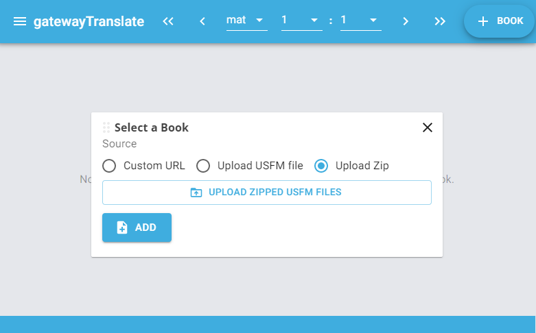

<div id="top"></div>

[Contributors](https://github.com/RUN-Collaborations/gateway-translate/graphs/contributors)
    ·
[Other Forks](https://github.com/unfoldingWord/gateway-translate/network/members)
    ·
[MIT License](https://github.com/RUN-Collaborations/gateway-translate/blob/main/LICENSE)

<!-- PROJECT LOGO -->
<br />
<div align="center">

<h3 align="center">Offline Fork of gatewayTranslate</h3>

  <p align="center">
    This application is for use by translators who want or need to work offline.
    <br />
    <a href="https://github.com/RUN-Collaborations/gateway-translate/releases/tag/v0.0.18-poc%2B001">Windows Pre-Release v0.0.18-poc+001</a>
    ·
    <a href="https://translate-align-2414.netlify.app/">Preview Online</a>
  </p>
</div>


<!-- TABLE OF CONTENTS -->
<details>
  <summary>Table of Contents</summary>
  <ol>
    <li>
      <a href="#about-the-project">About The Project</a>
      <ul>
        <li><a href="#built-with">Built With</a></li>
      </ul>
    </li>
    <li>
      <a href="#getting-started">Getting Started</a>
      <ul>
        <li><a href="#install-windows-pre-release-or-preview-online">Install Windows Pre-Release or Preview Online</a></li>
        <li><a href="#to-recreate-electron-forge-make">To Recreate Electron Forge Make</a></li>
      </ul>
    </li>
    <li><a href="#roadmap">Roadmap</a></li>
    <li><a href="#contributing">Contributing</a></li>
    <li><a href="#license">License</a></li>
    <li><a href="#contact">Contact</a></li>
  </ol>
</details>


<!-- ABOUT THE PROJECT -->
## About The Project
**Upload Zipped USFM Files**


**View Texts**


**Purpose**
To provide a tool for Translation Teams to edit, translate, and align Scripture Texts offline, which are typically in [USFM format](https://ubsicap.github.io/usfm/).

**Problem**
There are few (if any) offline editors for edit, translate, and aligning USFM markup, especially focused on translation activities.

**Scope**
- Current scope is focused on editing USFM text and indicating alignment with the original language texts.

**Background**
This project is a fork of [unfoldingWord's Gateway Translate](https://github.com/RUN-Collaborations/gateway-translate), and uses components from the Open Components Ecosystem (OCE) extensively. In particular it relies on Proskomma, a scripture runtime engine for the editor component itself. The latter is also contributed to the OCE community and we welcome others to reuse it.

<p align="right">(<a href="#top">back to top</a>)</p>

### Built With


* [Electron Forge](https://www.electronforge.io/)
* [Next.js](https://nextjs.org/)
* [React.js](https://reactjs.org/)

<p align="right">(<a href="#top">back to top</a>)</p>


<!-- GETTING STARTED -->
## Getting Started

### Install Windows Pre-Release or Preview Online
* Add [font-detect-rhl](https://github.com/RUN-Collaborations/font-detect-rhl)
* [Windows Pre-Release v0.0.18-poc+001](https://github.com/RUN-Collaborations/gateway-translate/releases/tag/v0.0.18-poc%2B001)
* [Preview Online](https://translate-align-2414.netlify.app/)

### To Recreate Electron Forge Make

1. Clone the repo
   ```sh
   git clone https://github.com/RUN-Collaborations/gateway-translate.git
   ```
2. Install packages
   ```sh
   yarn install
   ```
3. Start the local server with or without Electron 
    * `yarn dev` then visit <a href="http://localhost:3000">localhost:3000</a>,
    * Or `yarn predev` then use the Electron window or visit <a href="http://localhost:3000">localhost:3000</a>.
4. Build and Export  
   ```sh
   yarn build && yarn export
   ```
5. Manually change .next/ to relative paths
    * In `.next\server\pages\*.html` and `.next\static\chunks\main-*.js` replace: `"/_next/` with: 	`"../../`.
    * Launch `.next\server\pages\*.html` in a local web browser and click through to confirm relative paths are setup as needed.
6. Package or Make
   ```sh
   yarn package
   ```
    * Then review `/out/`,
    * Or:
   ```sh
   yarn make
   ```
    * Then review `/out/make/`.

<p align="right">(<a href="#top">back to top</a>)</p>

<!-- ROADMAP -->
## Roadmap

* The Getting Started steps above leave `.next\static\css\*.css` looking for NotoSans-Regular.ttf and NotoSans-Bold.ttf in `/static/`. These needs to be manually added or factored into the build process for it to be able to find them.
* Add [font-detect-rhl](https://github.com/RUN-Collaborations/font-detect-rhl)
* Add alignment capability
* Facitilate starting of new projects rather than assuming import of existing projects\
* Add MacOS and Linux installation files
* Leverage Electronite Forge once available

<p align="right">(<a href="#top">back to top</a>)</p>


<!-- CONTRIBUTING -->
## Contributing

Contributions are what make the open source community such an amazing place to learn, inspire, and create. Any contributions you make are **greatly appreciated**.

You can also simply open an issue with the tag "enhancement".

If you would like to fork the repo and create a pull request. 

1. Fork the Project
2. Create your Feature Branch (`git checkout -b feature/AmazingFeature`)
3. Commit your Changes (`git commit -m 'Add some AmazingFeature'`)
4. Push to the Branch (`git push origin feature/AmazingFeature`)
5. Open a Pull Request

<p align="right">(<a href="#top">back to top</a>)</p>


<!-- LICENSE -->
## License

Distributed under the MIT License. See `LICENSE` for more information.

<p align="right">(<a href="#top">back to top</a>)</p>

